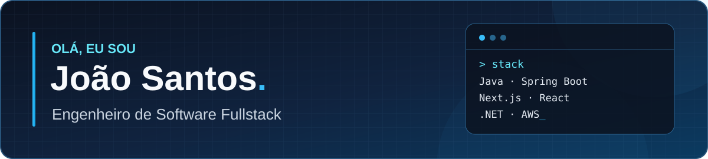

  

   

  
  
  
  
  

 

## Sobre mim

Sou engenheiro de software fullstack com mais de **3 anos de experiência**, construindo aplicações da interface ao deploy. Trabalho com **Java e Spring Boot** e **Next.js e React** tanto na **Fidelizar+** quanto no **Projeto Nufuturo (UFCG + Nubank)**.

- 🛒 **Fidelizar+:** integrações com plataformas de e-commerce, APIs, webhooks e widgets de cashback. Também atuo com C#/.NET, RabbitMQ, Redis e CI/CD.
- ☁️ **Projeto Nufuturo:** aplicações e APIs com Java/Spring Boot, Next.js, Python/Flask e Clojure/Pedestal; processamento de arquivos e dados com AWS S3, Lambda, SQS, DynamoDB e AuroraDB.
- 🎓 **Formação:** Bacharel em Ciência da Computação pela Universidade Federal de Campina Grande (UFCG).

## GitHub em números

  
  

## Tecnologias

  

 

  <strong>Também trabalho com:</strong> ASP.NET Core · RabbitMQ · DynamoDB · GitHub Actions · APIs REST · Webhooks · testes

## Vamos conversar?

  
  
  

## Contribuições

  <picture>
    <source media="(prefers-color-scheme: dark)" srcset="./profile/snake-dark.svg" />
    <source media="(prefers-color-scheme: light)" srcset="./profile/snake-light.svg" />
    
  </picture>

